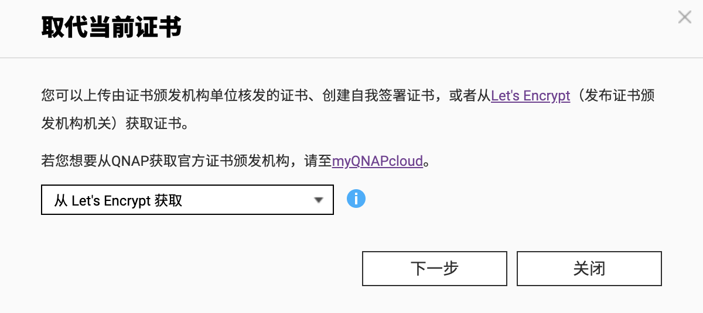
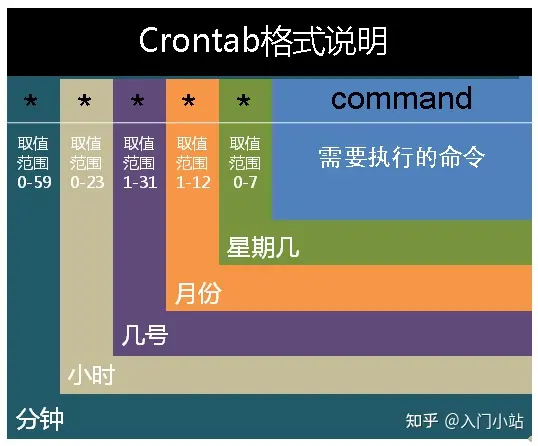
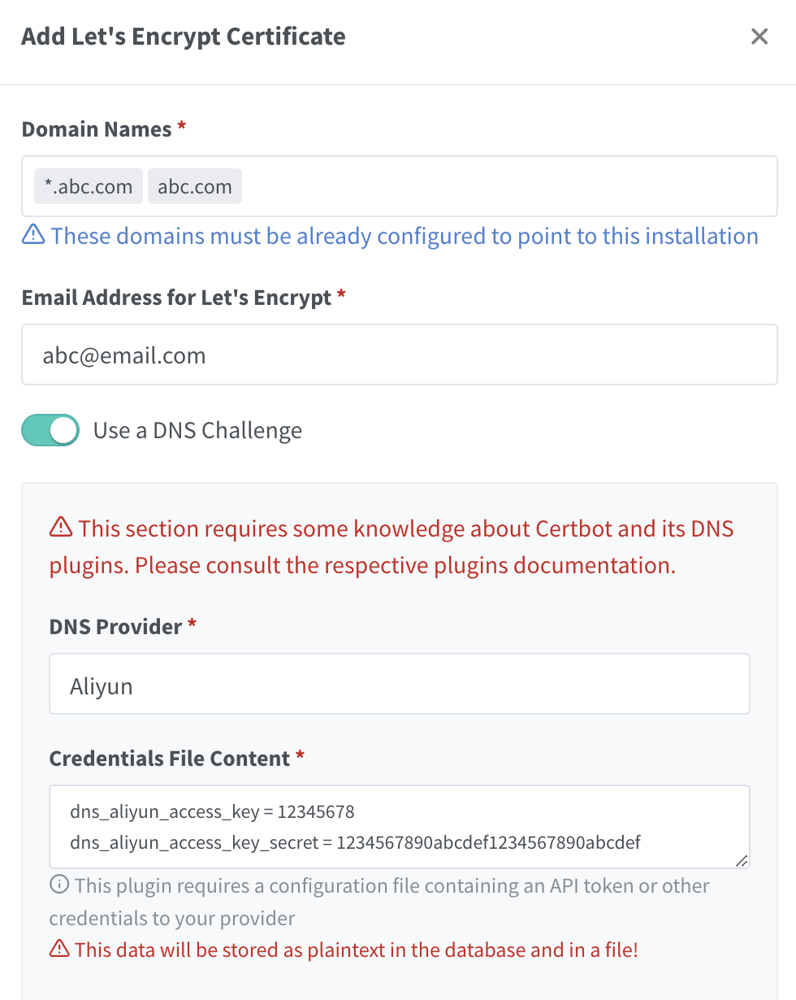
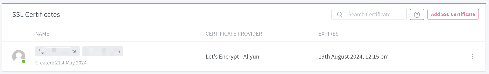
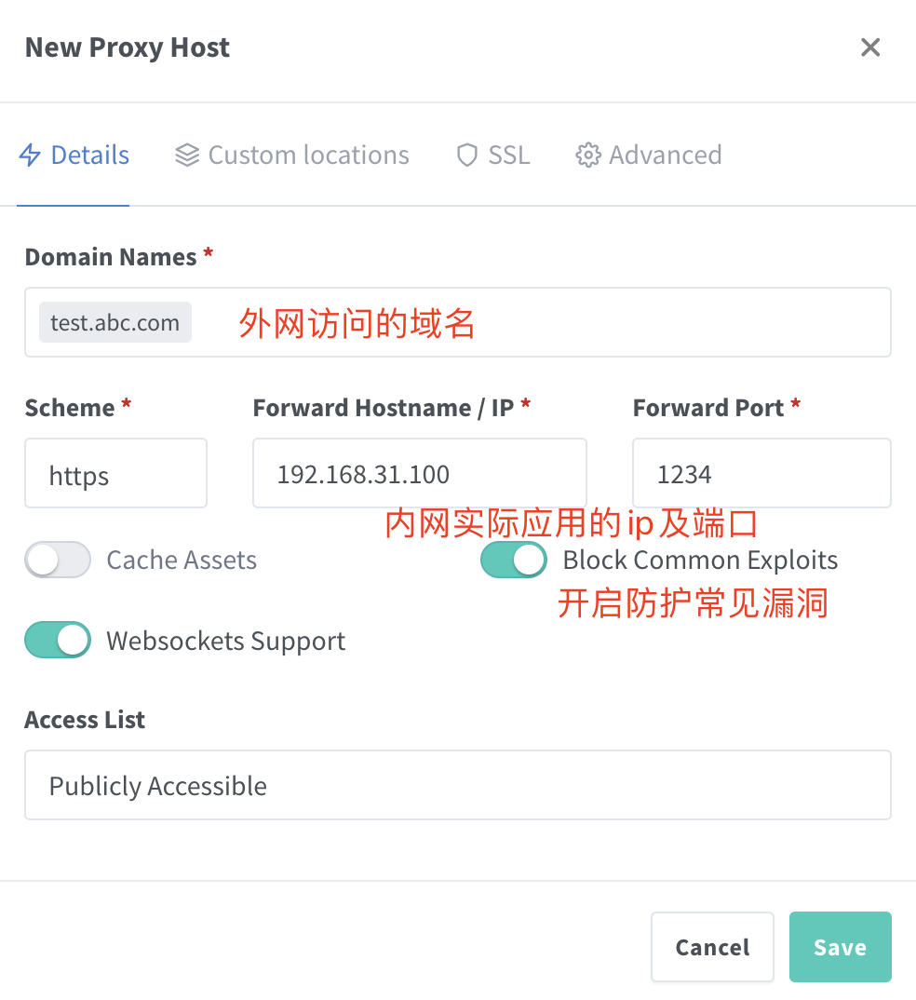
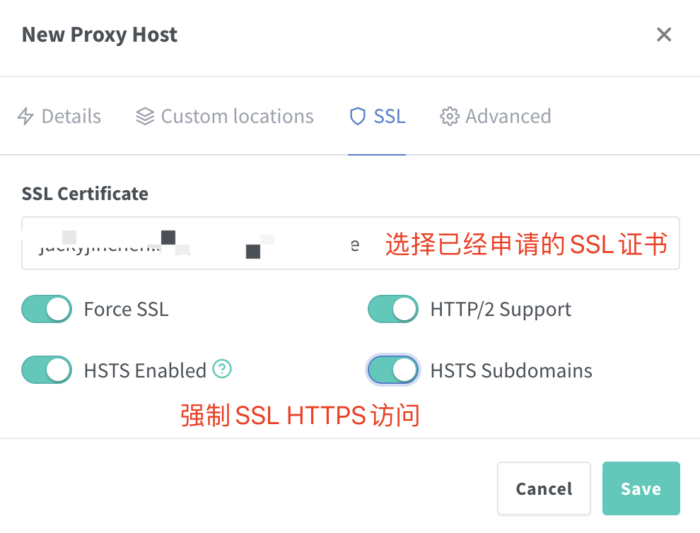

## 要做什么？

开始研究nas时候为了方便，会将所有应用的端口直接通过**路由器端口转发**给外网使用，且很多都是http方式访问，给nas的安全性带来隐患。

1. 通过申请SSL，提升应用为https访问。
2. 使用nginx管理端口转发，减少公网端口暴露。

## 什么是SSL

**SSL** - Secure Sockets Layer,现在应该叫"TLS",但由于习惯问题,我们还是叫"SSL"比较多.http协议默认情况下是不加密内容的,这样就很可能在内容传播的时候被别人监听到,对于安全性要求较高的场合,必须要加密,https就是带加密的http协议,而https的加密是基于SSL的。

**OpenSSL** - 简单地说,OpenSSL是SSL的一个实现,SSL只是一种规范.理论上来说,SSL这种规范是安全的,目前的技术水平很难破解,但SSL的实现就可能有些漏洞,如著名的"心脏出血".

## 证书标准

**X.509** - 这是一种证书标准,主要定义了证书中应该包含哪些内容.其详情可以参考RFC5280,SSL使用的就是这种证书标准.

## 编码格式

同样的X.509证书,可能有不同的编码格式,目前有以下两种编码格式.

**PEM** - Privacy Enhanced Mail,打开看文本格式,以"-----BEGIN..."开头, "-----END..."结尾,内容是BASE64编码.
查看PEM格式证书的信息:openssl x509 -in certificate.pem -text -noout
Apache和*NIX服务器偏向于使用这种编码格式.

**DER** - Distinguished Encoding Rules,打开看是二进制格式,不可读.
查看DER格式证书的信息:openssl x509 -in certificate.der **-inform der** -text -noout
Java和Windows服务器偏向于使用这种编码格式.

## 相关的文件扩展名

这是比较误导人的地方,虽然我们已经知道有PEM和DER这两种编码格式,但文件扩展名并不一定就叫"PEM"或者"DER",常见的扩展名除了PEM和DER还有以下这些,它们除了编码格式可能不同之外,内容也有差别,但大多数都能相互转换编码格式.

**CRT** - CRT应该是certificate的三个字母,其实还是证书的意思,常见于*NIX系统,有可能是PEM编码,也有可能是DER编码,大多数应该是PEM编码,相信你已经知道怎么辨别.

**CER** - 还是certificate,还是证书,常见于Windows系统,同样的,可能是PEM编码,也可能是DER编码,大多数应该是DER编码.

**KEY** - 通常用来存放一个公钥或者私钥,并非X.509证书,编码同样的,可能是PEM,也可能是DER.
查看KEY的办法:openssl rsa -in mykey.key -text -noout
如果是DER格式的话,同理应该这样了:openssl rsa -in mykey.key -text -noout **-inform der**

**CSR** - Certificate Signing Request,即证书签名请求,这个并不是证书,而是向权威证书颁发机构获得签名证书的申请,其核心内容是一个公钥(当然还附带了一些别的信息),在生成这个申请的时候,同时也会生成一个私钥,私钥要自己保管好.做过iOS APP的朋友都应该知道是怎么向苹果申请开发者证书的吧.
查看的办法:openssl req -noout -text -in my.csr (如果是DER格式的话照旧加上-inform der,这里不写了)

**PFX/P12** - predecessor of PKCS#12,对*nix服务器来说,一般CRT和KEY是分开存放在不同文件中的,但Windows的IIS则将它们存在一个PFX文件中,(因此这个文件包含了证书及私钥)这样会不会不安全？应该不会,PFX通常会有一个"提取密码",你想把里面的东西读取出来的话,它就要求你提供提取密码,PFX使用的时DER编码,如何把PFX转换为PEM编码？
openssl pkcs12 -in for-iis.pfx -out for-iis.pem -nodes
这个时候会提示你输入提取代码. for-iis.pem就是可读的文本.
生成pfx的命令类似这样:openssl pkcs12 -export -in certificate.crt -inkey privateKey.key -out certificate.pfx -certfile CACert.crt

其中CACert.crt是CA(权威证书颁发机构)的根证书,有的话也通过-certfile参数一起带进去.这么看来,PFX其实是个证书密钥库.

**JKS** - 即Java Key Storage,这是Java的专利,跟OpenSSL关系不大,利用Java的一个叫"keytool"的工具,可以将PFX转为JKS,当然了,keytool也能直接生成JKS,不过在此就不多表了.

## 证书编码的转换

**PEM转为DER** openssl x509 -in cert.crt -outform der -out cert.der

**DER转为PEM** openssl x509 -in cert.crt -inform der -outform pem -out cert.pem

(提示:要转换KEY文件也类似,只不过把x509换成rsa,要转CSR的话,把x509换成req...)

## 获得证书

**向权威证书颁发机构申请证书**

用这命令生成一个csr: openssl req -newkey rsa:2048 -new -nodes -keyout my.key -out my.csr
把csr交给权威证书颁发机构,权威证书颁发机构对此进行签名,完成.保留好csr,当权威证书颁发机构颁发的证书过期的时候,你还可以用同样的csr来申请新的证书,key保持不变.

**或者生成自签名的证书**

openssl req -newkey rsa:2048 -new -nodes -x509 -days 3650 -keyout key.pem -out cert.pem
在生成证书的过程中会要你填一堆的东西,其实真正要填的只有Common Name,通常填写你服务器的域名,如"yourcompany.com",或者你服务器的IP地址,其它都可以留空的.


## 利用acme通过letsencrypt申请证书

**acme.sh 实现了 `acme` 协议, 可以从 letsencrypt 生成免费的证书.**

https://github.com/acmesh-official/acme.sh

威联通Nas可以直接申请，但需要开放80和443端口（运营商已经屏蔽）,因此可自行申请证书，并替换。

nas内部应用公网开放同样存在安全问题，为了避免过多开放端口，可以使用Nginx来转发。




```shell
#安装acme
curl https://get.acme.sh | sh -s email=jackyjinchen@163.com
#切换为Letsencrypt
sh /root/.acme.sh/acme.sh --set-default-ca --server letsencrypt
#根据阿里云DNS生成证书
export Ali_Key="key" 
export Ali_Secret="secret"
#包括泛解析
sh /root/.acme.sh/acme.sh --issue --dns dns_ali -d 'abc.com' -d '*.abc.com'

#生成证书文件并部署(后切换为使用Nginx Proxy Manager)
#sh /root/.acme.sh/acme.sh --install-cert -d abc.com  --cert-file backup.cert --key-file backup.key


#生成证书供Plex使用（Plex需要加密的pfx格式证书）
#openssl pkcs12 -export -out plex.pfx -certpbe AES-256-CBC -keypbe AES-256-CBC -macalg SHA256 -inkey backup.key -in backup.cert -password pass:[加密密码]

#(后切换为使用Nginx Proxy Manager)
openssl pkcs12 -export -out plex.pfx -certpbe AES-256-CBC -keypbe AES-256-CBC -macalg SHA256 -inkey privkey.pem -in cert.pem -password pass:xxxxxx


#QNAP更新证书方式
cp cert.pem /etc/stunnel/backup.crt
cp privkey.pem /etc/stunnel/backup.key

#生成stunnel证书文件（单纯合并两个文件而已......）
cat /etc/stunnel/backup.cert /etc/stunnel/backup.key > /etc/stunnel/stunnel.pem

#重启Qnap服务
/etc/init.d/stunnel.sh restart
/etc/init.d/Qthttpd.sh restart
```

上述程序可以设置为crontab定期自动运行，设置方法如下：



### **命令格式**

```
crontab [-u user] file` `crontab [-u user] { -e | -l | -r }
```

### **命令参数**

- -u user：用来设定某个用户的crontab服务；
- file：file是命令文件的名字,表示将file做为crontab的任务列表文件并载入crontab。如果在命令行中没有指定这个文件，crontab命令将接受标准输入（键盘）上键入的命令，并将它们载入crontab。
- -e：编辑某个用户的crontab文件内容。如果不指定用户，则表示编辑当前用户的crontab文件。
- -l：显示某个用户的crontab文件内容，如果不指定用户，则表示显示当前用户的crontab文件内容。
- -r：从`/var/spool/cron`目录中删除某个用户的crontab文件，如果不指定用户，则默认删除当前用户的crontab文件。
- -i：在删除用户的crontab文件时给确认提示。

```shell
#查询所有的定时任务
crontab -l
#新增定时任务
crontab -e
#0 1 1 * * /share/Public/acme/acme_update.sh > /share/Public/acme/acme.log& 
```


## 利用Nginx Proxy Manager来申请证书

nginx作用可以参考我的笔记https://github.com/Jackyjinchen/Nginx_Study

**Nginx proxy manager是一个可视化管理nginx的好工具**，便利性在于：

1. 可以可视化配置转发配置、不用直接更改conf文件。
2. 包含了acme自动更新，定期自动更新证书文件。

### docker部署

```yaml
version: '3.8'
services:
  app:
    image: 'docker.io/jc21/nginx-proxy-manager:latest'
    restart: unless-stopped
    ports:
      - '80:80' #http端口，可映射为其他端口
      - '81:81' #管理端口
      - '443:443' #https监听端口
    volumes:
      - ./data:/data #文件位置，nginx实际配置文件都在这里
      - ./letsencrypt:/etc/letsencrypt #lesencrypt签名位置
```

对应81端口为管理端口，默认用户名密码：

Email: `admin@example.com`
Password: `changeme`

### 申请SSL证书



添加SSL证书，这里添加阿里云的access key和secret，点击后就生成了3个月的证书。



### 配置转发

路由器可配置端口转发，转发映射NPM的443和80端口为外网高位端口，例如443 -> 16443，供外网访问。



配置ssl证书：




配置完成后，外网既可以通过nginx访问对应的应用，例如：

https://test.abc.com:16443 -> https://192.168.31.100:1234

通过配置多个泛域名形式的nginx转发规则，可实现一个端口访问所有的内网功能。

### 常见问题

在配置onlyoffice时候我遇到一个问题，nginx转发中会**将端口丢弃**，可通过**Advanced配置**中加入手动配置来修改

```shell
location / {
   proxy_pass https://192.168.31.100:3001/;  #对应服务的实际地址（包含端口）
   proxy_set_header Host $http_host;
   proxy_redirect  http:// https://; 
   proxy_set_header X-Forwarded-Host  $http_host;
   proxy_set_header X-Forwarded-Port  $server_port;
   proxy_set_header X-Forwarded-Proto $scheme;
   proxy_set_header X-Forwarded-Scheme $scheme;
   proxy_set_header X-Real-IP         $remote_addr;
   proxy_set_header X-Forwarded-For   $remote_addr;
   proxy_set_header Upgrade    $http_upgrade;
   proxy_set_header Connection $http_connection;
   proxy_http_version 1.1;
}
```

### 结合NPM与手工crontab任务实现证书自动更新

结合上述两个配置，可以**首先**使用NPM自动更新证书文件，**然后**编写脚本配置crontab任务，定期更新qnap与plex的证书。


参考文献

1. https://www.cnblogs.com/guogangj/p/4118605.html

